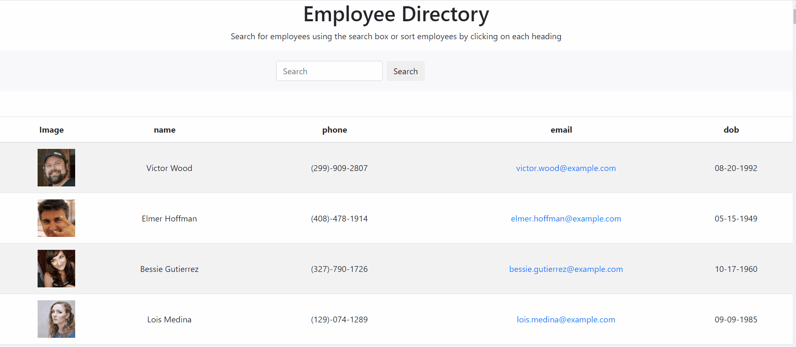

# Employee-Directory


### About
This application was created using React. The user can search for employees by name in the search box, or they can sort by ascending or descending order by name, phone number or email.

---



---

### Getting Started

* Begin installing Create React App globally by running the following command in your terminal: `npx create-react-app <appname>` where `<appname>` is what you want to name your app. Example: `npx create-react-app practiceapp`.

---

### Code Highlight

The code snippet belows demonstrate how context is used to prevent code drilling. This code allow for user to click on the heading and it will execute the function handleSort() that has been defined in this file's parent element.

```js
   {context.developerState.headings.map(({name,width})=>{
                            return(
                                <th
                                className="col"
                                key={name}
                                style={{width}}
                                onClick={()=>{context.handleSort(name)}}
                                >
                                    {name}
                                    <span className="pointer"></span>
                                </th>
                            );
                        })}
```

---

### Deploy Link

[Live site](https://mtbanh.github.io/Clicky-Game/)

---
## Authors 
### [Mai Banh](https://github.com/mtbanh)
- [LinkedIn](https://www.linkedin.com/in/banhtmai/)
- [Portfolio]( )

- email: maibanh1996@gmail.com